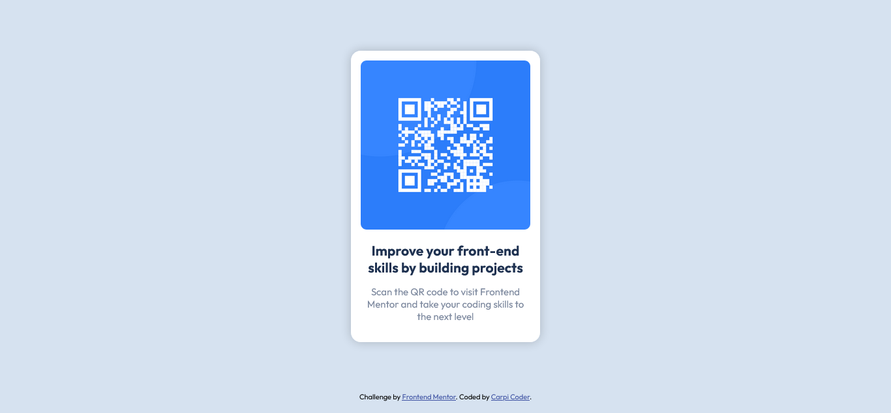

# Frontend Mentor - QR code component solution

This is a solution to the [QR code component challenge on Frontend Mentor](https://www.frontendmentor.io/challenges/qr-code-component-iux_sIO_H). Frontend Mentor challenges help you improve your coding skills by building realistic projects. 

## Table of contents

- [Overview](#overview)
  - [Screenshot](#screenshot)
  - [Links](#links)
- [My process](#my-process)
  - [Built with](#built-with)
- [Author](#author)
- [Acknowledgments](#acknowledgments)

**Note: Delete this note and update the table of contents based on what sections you keep.**

## Overview

### Screenshot

### Links

- Solution URL: [Click here](https://github.com/carpicoder/qr-code-component)
- Live Site URL: [Click here](https://carpicoder.github.io/qr-code-component)

## My process

### Built with

- Semantic HTML5 markup
- CSS
- SCSS
- Flexbox
- Responsive design

## Author

- Frontend Mentor - [@carpicoder](https://www.frontendmentor.io/profile/carpicoder)
- GitHub - [@carpicoder](https://github.com/carpicoder)
- YouTube - [Carpi Coder](https://youtube.com/c/carpicoder)